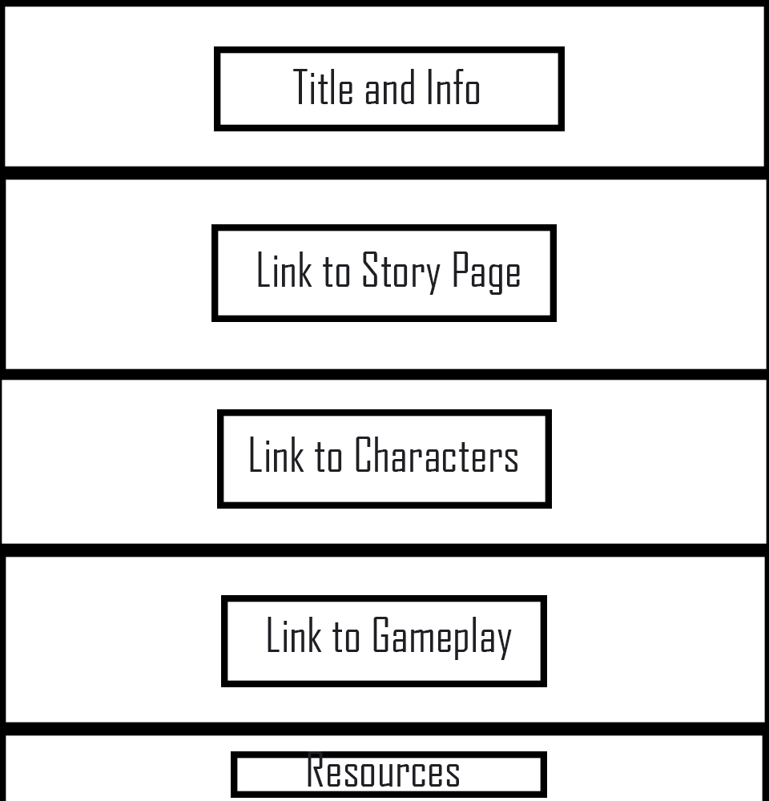
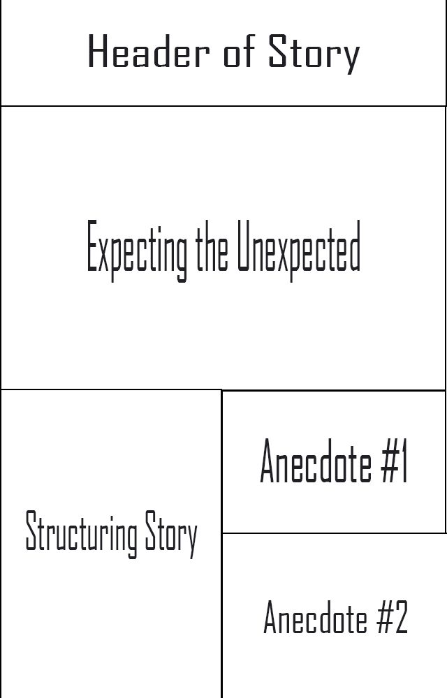
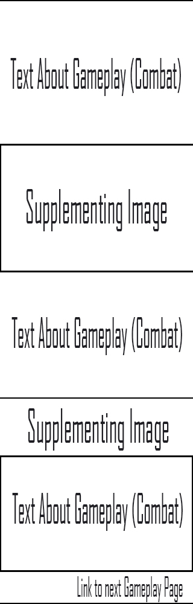

# MART341_finalproject

I decided that, since I've already done video games half to death and I don't think I have enough material to make a website about myself, so I decided 'why not make a website on one of the few things in this world that I'm not too bad at, Dungeons and Dragons?' Particularly, DMing. I started brainstorming all the major categories I'd need to go into. I came up with;

1. Resources
  * Including links to outside sites for stats on pre-created monsters, combat rules, equipment, and classes.
2. Story
  * Structuring an overall plotline for a campaign.
  * Example Anecdote from my own experience.
  * Expecting your players to derail your story (because players) and how to keep everything moving.
  * Example Anecdote from my own experience.
3. Gameplay
  * Running Combat
  * Roleplaying and Allowing for Character
  * Using Soundtracks to Supplement the Experience.
4. Characters
  * Creating the Player Characters
  * Creating Non-Player Characters
  * Giving Characters Themes

I've had a good deal of experience in Dungeons and Dragons, and writing a run-down for new players could be really, really fun!

## Check-in 2

I created 3 wireframes that make up most of my website. They're all crunched to fit on the document, so I figured I'd explain them each here.

Page 1: The Main Page

The main page will utilize Parallax scrolling. As you scroll down and are provided with links to the other four pages that make up the website (in addition to having a short description of each section of the site), there'll be large images that box in each descriptory section of content.

Page 2: The Story Page

The story page is by far going to be my most difficult page. It uses a simple box form to list all the dialog based content (the anecdotes will be media that would be full videos, but I may end up just recording audio files and using those to tell the anecdotes. Placing those in a way that I'm satisfied with will be difficult, as I've never been good at using boxes to stack boxes horizontally.

Page 3: The Gameplay Page

The gameplay page repeats a basic pattern, over and over again, as you move through three pages. First, a page regarding the basics of combat that has a text section, than an image that helps make the point. Once the basics of combat have been explained, then there's a link to the next gameplay page, which regards Roleplaying. After that page, then there's one more page regarding Soundtracks which will provide links to Youtube videos of songs to use as examples. After that, the move to the next page becomes a return to the home page.

Page 4: Creating Characters
The Character Page is a simple box form that goes over everything, much like the current DnD instruction pages that exist online -- a banner listing what section has been entered, than a barrage of text that explains the concept, with some images and such to supplement the content. All three of the character sections will be on the same web page.

Page 5: Resources
This page is a massive number of dropdown lists that link to official resources for the Pathfinder game system, as well as having a fake email to fufill the contact requirement of the assignment.
